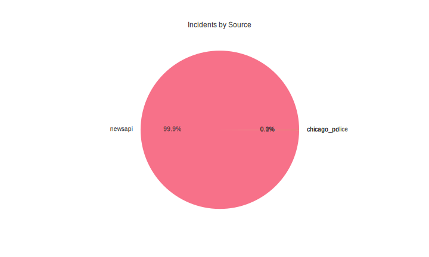
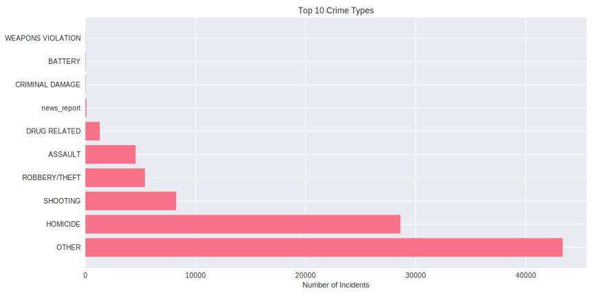

Loaded 73993 incidents
Date range: 2024-01-01 00:00:00 to 2025-12-02 12:45:55

Incidents by source:
source
newsapi           73892
chicago_pd          100
chicago_police        1
Name: count, dtype: int64

Report saved to reports/latest_analysis.md
bution.svg)

## Source Distribution

## Crime Types

## Recent Incidents

### OTHER on 2025-12-02 12:45
- Location: Whyevolutionistrue.com
- Description: Welcome to the Cruelest Day: Tuesday, December 2, 2025, and National Fritters Day. Fritters of many forms are found worldwide; here are banana fritters from Kerala, a state in south India: It’s also Business of Popping Corn Day, celebrating the day in 1885 wh…

### OTHER on 2025-12-02 12:41
- Location: The New Republic
- Description: The following is a lightly edited transcript of the December 2 episode of the Daily Blast podcast. Listen to it here.Greg Sargent: This is The Daily Blast from The New Republic, produced and presented by the DSR Network. I’m your host, Greg Sargent. President…

### HOMICIDE on 2025-12-02 12:30
- Location: TODAY
- Description: In the pre-trial hearing of accused killer Luigi Mangione, prosecutors presented audio of the crucial 911 call by a McDonald's manager that helped lead to his arrest in Pennsylvania. Mangione appeared at the hearing in civilian clothes where his defense team …

### HOMICIDE on 2025-12-02 12:30
- Location: Fox News
- Description: The FBI offered a $50,000 reward as a manhunt continues for Stockton, California, shooting suspects who killed 4 at a child's birthday party on Saturday.

### OTHER on 2025-12-02 12:29
- Location: The Local Sweden
- Description: Two districts in Stockholm and four in Malmö classed as "especially vulnerable" by police have seen less crime in 2025, according to a biennial assessment by Swedish police. But two districts in Gothenburg and Borås have seen the situation worsen.

Analysis generated at: Wed Dec  3 12:55:03 UTC 2025
