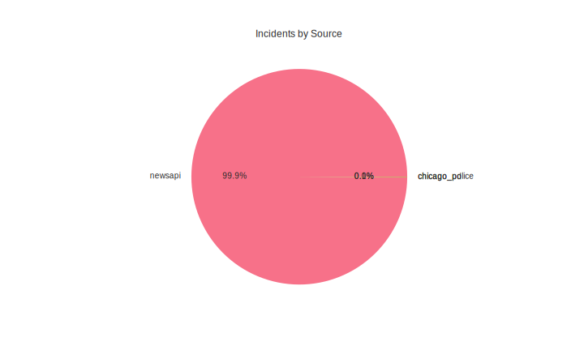
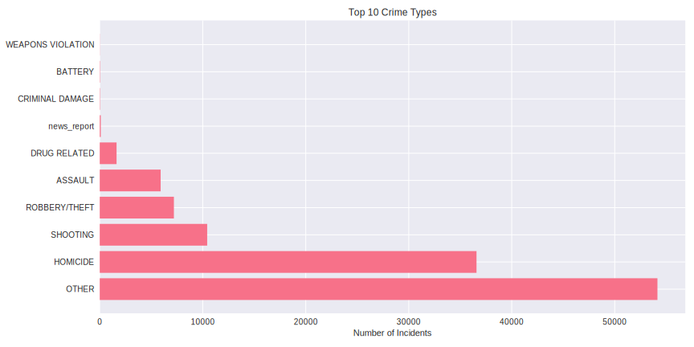

Loaded 96564 incidents
Date range: 2024-01-01 00:00:00 to 2026-03-30 07:04:56

Incidents by source:
source
newsapi           96463
chicago_pd          100
chicago_police        1
Name: count, dtype: int64

Report saved to reports/latest_analysis.md
bution.svg)

## Source Distribution

## Crime Types

## Recent Incidents

### HOMICIDE on 2026-03-30 07:04
- Location: New York Post
- Description: Australian police said they believe they shot dead a suspect Monday accused of killing two police officers and seriously wounding a third in a remote forest region seven months ago.

### OTHER on 2026-03-30 07:00
- Location: Inside Higher Ed
- Description: The Complexity Curve

Sara Brady

Mon, 03/30/2026 - 03:00 AM

At a certain point of understanding, simplicity and clarity return, albeit with more nuance.
 
 Byline(s)

 
 Matt Reed

### OTHER on 2026-03-30 06:46
- Location: DW (English)
- Description: Three paintings by French masters Cezanne, Renoir, and Matisse have been taken from a museum near the Italian city of Parma.

### OTHER on 2026-03-30 06:45
- Location: soompi
- Description: tvN’s Monday–Tuesday drama “Siren’s Kiss” has unveiled new stills ahead of its upcoming episode! “Siren’s Kiss” is a romance thriller that follows inspector Cha Woo Seok (Wi Ha Joon) as he investigates an insurance fraud case involving people who all died aft…

### OTHER on 2026-03-30 06:40
- Location: ABC News (AU)
- Description: A man has pleaded guilty in Toowoomba District Court today to two counts of fraud as an employee, with one of those fraud charges involving more than $100,000.

Analysis generated at: Tue Mar 31 07:07:02 UTC 2026
