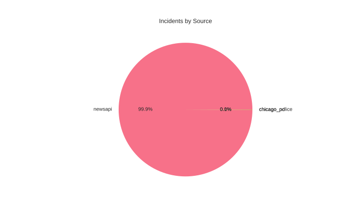
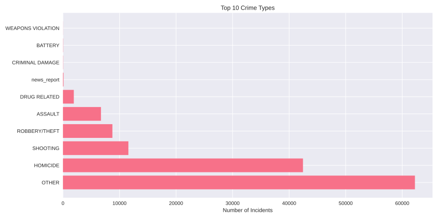

Loaded 128152 incidents
Date range: 2024-01-01 00:00:00 to 2026-08-29 19:58:13

Incidents by source:
source
newsapi           128051
chicago_pd           100
chicago_police         1
Name: count, dtype: int64

Report saved to reports/latest_analysis.md
ion.svg)

## Source Distribution

## Crime Types

## Recent Incidents

### ROBBERY/THEFT on 2026-08-29 19:58
- Location: Fox News
- Description: Pabst Blue Ribbon says 40,000 pounds of its beer vanished in California as police probe fraudulent paperwork used at a distribution center pickup.

### HOMICIDE on 2026-08-29 19:48
- Location: The Times of India
- Description: Sonbhadra: Police say wife and lover strangled husband after he caught them, slammed his head, then dumped body roadside to fake road accident; 4 arrested.

### OTHER on 2026-08-29 19:48
- Location: The Times of India
- Description: Seven unidentified bodies were recovered from the Gandak (Narayani) river in UP’s Maharajganj and Kushinagar after Nepal floods raised water flow; ID efforts ongoing.

### OTHER on 2026-08-29 19:48
- Location: The Times of India
- Description: Two Hardoi workers at Nepal’s Upper Trishuli Power Project missing after floods; families urge PM Modi and UP CM Yogi to help trace and bring them home.

### OTHER on 2026-08-29 19:47
- Location: The Times of India
- Description: Chhattisgarh HC quashes State Women Commission’s directive to transfer a school principal, ruling it lacks jurisdiction to alter employee service conditions.

Analysis generated at: Sun Aug 30 20:25:21 UTC 2026
