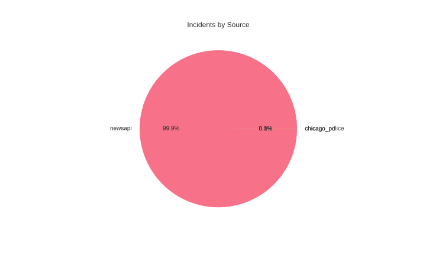
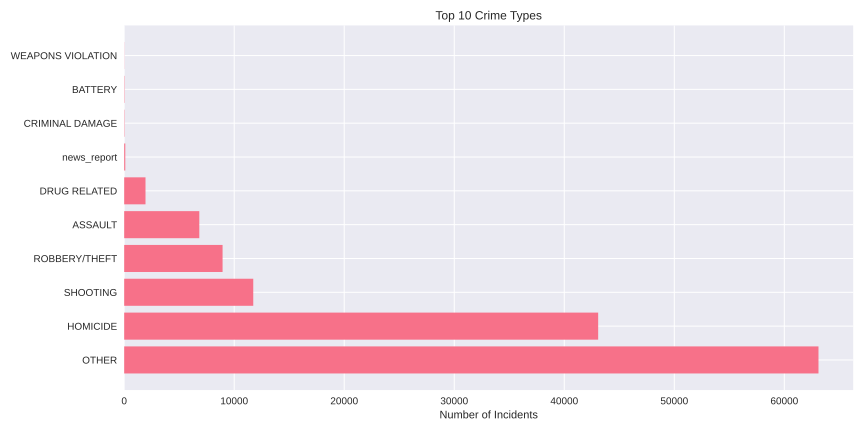

Loaded 137534 incidents
Date range: 2024-01-01 00:00:00 to 2026-10-05 05:26:45

Incidents by source:
source
newsapi           137433
chicago_pd           100
chicago_police         1
Name: count, dtype: int64

Report saved to reports/latest_analysis.md
ion.svg)

## Source Distribution

## Crime Types

## Recent Incidents

### OTHER on 2026-10-05 05:26
- Location: The Times of India
- Description: Protesters assembled outside the Parliament Street police station, asking for an FIR regarding sexual harassment claims. Three women journalists alleged police personnel harassed them during a protest at Jantar Mantar. They criticized the police for not provi…

### OTHER on 2026-10-05 04:44
- Location: CNA
- Description: The victim, a 15-year-old student at the time, suffered from nightmares and struggled to trust adults after what happened.

### ROBBERY/THEFT on 2026-10-05 04:44
- Location: The Times of India
- Description: A gold robbery at Kheda Railway Station in Gujarat was solved within hours after Ahmedabad Rural Police and Railway Police tracked down all four accused. Police recovered 2.90 kg of gold worth around Rs 4 crore and two vehicles used in the crime. The operatio…

### OTHER on 2026-10-05 04:44
- Location: CNA
- Description: The victim, a 15-year-old student at the time, suffered from nightmares and struggled to trust adults after what happened.

### ROBBERY/THEFT on 2026-10-05 04:34
- Location: Slashdot.org
- Description: PC Magazine reports:

In September, the infamous ShinyHunters hacking group claimed it had infiltrated the FBI job recruitment portal, stealing confidential data belonging to 5,000 employees and even changing the FBI logo to its own. The group has been impl…

Analysis generated at: Tue Oct  6 05:43:04 UTC 2026
