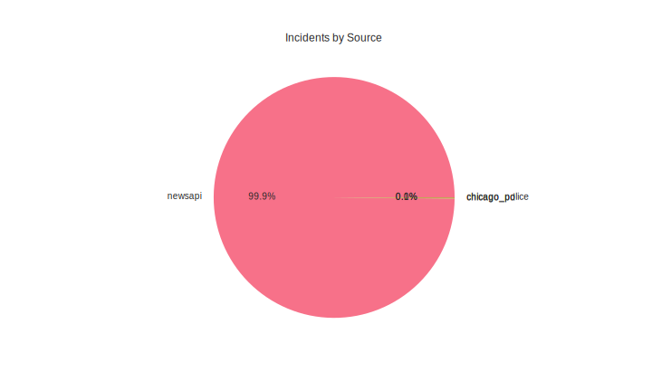

Loaded 62701 incidents
Date range: 2024-01-01 00:00:00 to 2025-10-04 12:39:30

Incidents by source:
source
newsapi           62600
chicago_pd          100
chicago_police        1
Name: count, dtype: int64

Report saved to reports/latest_analysis.md
bution.svg)

## Source Distribution

## Crime Types

## Recent Incidents

### OTHER on 2025-10-04 12:39
- Location: The Indian Express
- Description: As per the FIR, the seven accused are identified as Manthan Bhalerao, Om Nagarkar, Harshal Pawar, Piyush Bidkar, Atharva Nalawade, Omkar Mergu and Faizal Shaikh, all residents of Nana Peth area.

### HOMICIDE on 2025-10-04 12:32
- Location: Slashdot.org
- Description: 'Drop it now!': Video shows Michigan church shooter was ordered to give up before he was killedKSL TV 5 Michigan church shooting bodycam video shows police confront gunmanFox News What we learned from newly-released bodycam video in Michigan church attackClic…

### OTHER on 2025-10-04 12:30
- Location: The Indian Express
- Description: Punjab’s Anti-Gangster Task Force has arrested Gurpreet Singh alias Vicky Nihang, a close associate of fugitive gangsters Doni Bal and Munn Ghanshampuria, after a brief exchange of fire in Ludhiana Rural.

### OTHER on 2025-10-04 12:30
- Location: New York Post
- Description: A woke Build-A-Bear Workshop employee in Washington allegedly refused a teenaged customer’s wish to name her new teddy after slain conservative activist Charlie Kirk, according to a report.

### OTHER on 2025-10-04 12:27
- Location: The Times of India
- Description: Singer Zubeen Garg was "poisoned" in Singapore and his manager Siddharth Sharma and festival organiser Shyamkanu Mahanta had "deliberately chosen a foreign venue to conceal their conspiracy", the late singer's bandmate Shekhar Jyoti Goswami has alleged, accor…

Analysis generated at: Sun Oct  5 12:41:25 UTC 2025
